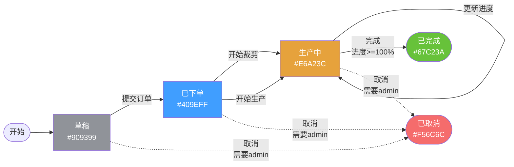

# 基础订单流程模板实现完成

## 📋 概述

已成功将 `core/workflow/order_workflow_advanced.go` 中定义的工作流规则转换为工作流设计器的**基础订单流程模板**。用户现在可以在工作流设计器的模板库中选择此模板，自动生成完整的订单工作流定义。

## 🎯 实现内容

### 1. 后端实现

#### 1.1 扩展DTO定义

**文件：`app/workflow/dto/designer.go`**

```go
// WorkflowTemplate 工作流模板（扩展版）
type WorkflowTemplate struct {
    ID          string                      `json:"id"`
    Name        string                      `json:"name"`
    Code        string                      `json:"code"`          // ✨ 新增
    Description string                      `json:"description"`
    Category    string                      `json:"category"`
    Icon        string                      `json:"icon"`
    Preview     string                      `json:"preview"`
    States      []WorkflowTemplateState     `json:"states,omitempty"`      // ✨ 新增
    Transitions []WorkflowTemplateTransition `json:"transitions,omitempty"` // ✨ 新增
}

// WorkflowTemplateState 模板状态定义
type WorkflowTemplateState struct {
    Code        string `json:"code"`
    Name        string `json:"name"`
    Type        string `json:"type"` // start, normal, end
    Color       string `json:"color"`
    Description string `json:"description"`
}

// WorkflowTemplateTransition 模板转换定义
type WorkflowTemplateTransition struct {
    From            string                   `json:"from"`
    To              string                   `json:"to"`
    Event           string                   `json:"event"`
    EventLabel      string                   `json:"event_label"`
    HasCondition    bool                     `json:"has_condition"`
    ConditionDesc   string                   `json:"condition_desc,omitempty"`
    RequireRole     string                   `json:"require_role,omitempty"`
    RoleDesc        string                   `json:"role_desc,omitempty"`
    AvailableFields []WorkflowConditionField `json:"available_fields,omitempty"`
}

// WorkflowConditionField 可用的条件字段
type WorkflowConditionField struct {
    Key         string `json:"key"`
    Label       string `json:"label"`
    Type        string `json:"type"` // number, string, boolean
    Description string `json:"description"`
}
```

#### 1.2 更新模板Handler

**文件：`app/workflow/transport/designer.go`**

更新了 `GetWorkflowTemplatesHandler()` 函数，添加了完整的基础订单流程模板，包括：

- **5个状态**：
  - 草稿（start, #909399）
  - 已下单（normal, #409EFF）
  - 生产中（normal, #E6A23C）
  - 已完成（end, #67C23A）
  - 已取消（end, #F56C6C）

- **9个转换规则**：
  - 草稿 → 已下单（提交订单）
  - 已下单 → 生产中（开始裁剪）
  - 已下单 → 生产中（开始生产）
  - 生产中 → 生产中（更新进度）
  - 生产中 → 已完成（完成，需要进度>=100%）✨ 带条件
  - 草稿/已下单/生产中 → 已取消（取消，需要admin权限）✨ 带权限

### 2. 前端实现

#### 2.1 类型定义扩展

**文件：`frontend/src/typings/api/workflow-designer.d.ts`**

```typescript
interface WorkflowTemplate {
  id: string
  name: string
  code?: string                                    // ✨ 新增
  description: string
  category: string
  icon: string
  preview: string
  states?: WorkflowTemplateState[]                 // ✨ 新增
  transitions?: WorkflowTemplateTransition[]       // ✨ 新增
}

interface WorkflowTemplateState {
  code: string
  name: string
  type: 'start' | 'normal' | 'end'
  color: string
  description: string
}

interface WorkflowTemplateTransition {
  from: string
  to: string
  event: string
  event_label: string
  has_condition?: boolean
  condition_desc?: string
  require_role?: string
  role_desc?: string
  available_fields?: WorkflowConditionField[]
}

interface WorkflowConditionField {
  key: string
  label: string
  type: 'number' | 'string' | 'boolean'
  description: string
}
```

#### 2.2 工作流设计器增强

**文件：`frontend/src/views/order/workflow/designer/index.vue`**

##### 2.2.1 模板加载逻辑

```typescript
// 在 onMounted 中处理模板参数
onMounted(async () => {
  const workflowId = route.query.id as string
  if (workflowId) {
    await loadWorkflow(workflowId)
  }
  
  // ✨ 新增：处理模板参数
  const templateId = route.query.template as string
  if (templateId) {
    await loadTemplate(templateId)
  }

  initLogicFlow()
})
```

##### 2.2.2 模板渲染功能

```typescript
// 加载模板
async function loadTemplate(templateId: string) {
  const { data } = await fetchWorkflowTemplates()
  if (data?.templates) {
    const template = data.templates.find(t => t.id === templateId)
    if (template) {
      // 填充表单
      workflowForm.value = {
        name: template.name,
        code: template.code || templateId,
        description: template.description,
      }
      
      // ✨ 自动渲染节点和连线
      if (template.states && template.states.length > 0) {
        renderTemplateToCanvas(template)
      }
    }
  }
}

// 将模板渲染到画布上
function renderTemplateToCanvas(template: Api.WorkflowDesigner.WorkflowTemplate) {
  if (!lf || !template.states || !template.transitions)
    return
  
  const nodes: any[] = []
  const edges: any[] = []
  
  // 计算布局位置（网格布局，每行3个节点）
  const startX = 300
  const startY = 100
  const horizontalGap = 250
  const verticalGap = 150
  
  // 创建节点
  template.states.forEach((state, index) => {
    const x = startX + (index % 3) * horizontalGap
    const y = startY + Math.floor(index / 3) * verticalGap
    
    nodes.push({
      id: state.code,
      type: 'rect',
      x, y,
      text: state.name,
      properties: {
        state: {
          code: state.code,
          name: state.name,
          type: state.type,
          description: state.description,
        },
        color: state.color,
      },
    })
  })
  
  // 创建连线（包含条件配置）
  template.transitions?.forEach((transition, index) => {
    const conditions: any[] = []
    
    // 如果有条件字段，自动创建条件
    if (transition.has_condition && transition.available_fields) {
      transition.available_fields.forEach((field) => {
        conditions.push({
          field: field.key,
          operator: 'gte',
          value: field.type === 'number' ? 1.0 : '',
        })
      })
    }
    
    edges.push({
      id: `edge_${index}`,
      type: 'polyline',
      sourceNodeId: transition.from,
      targetNodeId: transition.to,
      text: transition.event_label,
      properties: {
        event: transition.event,
        eventLabel: transition.event_label,
        requireRole: transition.require_role || '',
        conditions,
      },
    })
  })
  
  // 渲染到画布
  lf.render({ nodes, edges })
  
  // 自动居中
  setTimeout(() => {
    lf.translateCenter()
  }, 100)
}
```

## 📊 基础订单流程模板详情

### 状态定义

| 状态编码 | 状态名称 | 类型 | 颜色 | 说明 |
|---------|---------|------|------|------|
| `draft` | 草稿 | start | #909399 | 订单初始状态，可以编辑订单信息 |
| `ordered` | 已下单 | normal | #409EFF | 订单已提交，等待开始生产 |
| `production` | 生产中 | normal | #E6A23C | 订单正在生产，可以更新进度 |
| `completed` | 已完成 | end | #67C23A | 订单已完成，进度达到100% |
| `cancelled` | 已取消 | end | #F56C6C | 订单已取消，需要管理员权限 |

### 转换规则

| 从状态 | 到状态 | 事件 | 事件标签 | 特殊要求 |
|--------|--------|------|----------|----------|
| draft | ordered | submit_order | 提交订单 | - |
| ordered | production | start_cutting | 开始裁剪 | - |
| ordered | production | start_production | 开始生产 | - |
| production | production | update_progress | 更新进度 | - |
| production | completed | complete | 完成 | ✅ 进度>=100% |
| draft | cancelled | cancel | 取消 | 🔒 需要admin权限 |
| ordered | cancelled | cancel | 取消 | 🔒 需要admin权限 |
| production | cancelled | cancel | 取消 | 🔒 需要admin权限 |

## 🎨 使用流程

### 1. 打开工作流设计器列表页
访问：`/order/workflow/designer`

### 2. 点击"模板库"按钮
打开模板库弹窗，显示所有可用模板。

### 3. 选择"基础订单流程"模板
- **模板名称**：基础订单流程
- **图标**：📦
- **分类**：订单管理
- **预览**：草稿 → 已下单 → 生产中 → 已完成

### 4. 自动跳转到设计器页面
- URL参数：`/order/workflow/designer?template=basic_order_workflow`
- 自动填充表单：名称、编码、描述
- 自动渲染画布：5个节点 + 9条连线

### 5. 自定义调整（可选）
- 调整节点位置（拖拽）
- 修改节点属性（点击节点）
- 编辑连线条件（点击连线）
- 添加/删除节点和连线

### 6. 保存或发布
- 点击"保存"：保存草稿
- 点击"发布"：激活工作流，可用于订单

## 🔄 工作流流程图



## 🎁 新增/修改的文件

### 后端

| 文件路径 | 操作 | 说明 |
|---------|------|------|
| `app/order/services/workflow_template.go` | ✨ 新增 | 工作流模板服务（备用） |
| `app/order/dto/workflow_designer.go` | ✨ 新增 | 工作流模板DTO（备用） |
| `app/order/endpoint/workflow_designer.go` | ✨ 新增 | 工作流模板Endpoint（备用） |
| `app/order/transport/workflow_designer.go` | ✨ 新增 | 工作流模板Handler（备用） |
| `app/workflow/dto/designer.go` | 🔧 修改 | 扩展模板DTO定义 |
| `app/workflow/transport/designer.go` | 🔧 修改 | 更新模板Handler |

### 前端

| 文件路径 | 操作 | 说明 |
|---------|------|------|
| `frontend/src/typings/api/workflow-designer.d.ts` | 🔧 修改 | 扩展模板类型定义 |
| `frontend/src/views/order/workflow/designer/index.vue` | 🔧 修改 | 添加模板加载和渲染功能 |

### 文档

| 文件路径 | 操作 | 说明 |
|---------|------|------|
| `docs/基础订单流程模板实现完成.md` | ✨ 新增 | 本文档 |

## ✅ 测试建议

### 1. 模板库显示测试
- [ ] 打开工作流设计器列表页
- [ ] 点击"模板库"按钮
- [ ] 确认显示"基础订单流程"模板
- [ ] 确认模板卡片显示图标、名称、描述

### 2. 模板应用测试
- [ ] 点击"基础订单流程"模板
- [ ] 确认自动跳转到设计器页面
- [ ] 确认右侧表单自动填充
- [ ] 确认画布自动渲染5个节点
- [ ] 确认画布显示9条连线

### 3. 节点和连线测试
- [ ] 点击"草稿"节点，确认属性面板显示正确
- [ ] 点击"生产中 → 已完成"连线，确认显示进度条件
- [ ] 点击"草稿 → 已取消"连线，确认显示admin权限要求

### 4. 保存和发布测试
- [ ] 修改工作流编码为 `order_basic_v1`
- [ ] 点击"保存"，确认保存成功
- [ ] 点击"发布"，确认工作流激活
- [ ] 返回列表，确认新工作流显示在列表中

### 5. 订单集成测试
- [ ] 创建新订单
- [ ] 在订单详情页确认工作流状态显示
- [ ] 执行状态转换，确认按模板规则工作
- [ ] 尝试完成订单（进度<100%），确认被拒绝
- [ ] 更新进度到100%，确认可以完成

## 🚀 后续优化

1. **更多模板**：
   - 订单审批流程
   - 质检流程
   - 多级审批流程

2. **模板分类**：
   - 按类别筛选（订单、生产、审批）
   - 按使用频率排序

3. **模板导入/导出**：
   - 支持JSON格式导入导出
   - 支持从现有工作流创建模板

4. **智能布局**：
   - 使用力导向图算法自动布局
   - 支持垂直/水平/树形布局切换

5. **模板版本管理**：
   - 模板版本历史
   - 模板更新通知

## 📝 总结

✅ 已成功将 `order_workflow_advanced.go` 的工作流定义转换为可视化模板  
✅ 用户可以一键应用基础订单流程模板  
✅ 自动生成5个状态和9个转换规则  
✅ 支持条件检查和权限控制  
✅ 完全集成到工作流设计器中  

现在用户可以快速创建标准的订单工作流，无需手动绘制！🎉

