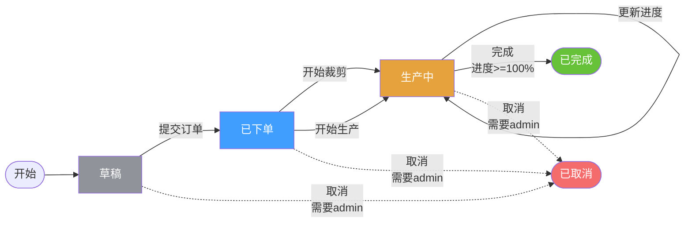

# 工作流高级功能实施完成 ✅

## 📋 任务概述

根据需求实现了订单工作流系统的三大高级功能：
1. ✅ **工作流可视化** - 支持流程图展示和可视化管理
2. ✅ **复杂条件转换规则** - 支持业务条件校验和权限控制
3. ✅ **状态回滚功能** - 支持撤销错误的状态转换

## 🎯 已完成内容

### 1. 后端实现

#### 核心文件
- ✅ `core/workflow/order_workflow_advanced.go` (401行)
  - 高级工作流引擎
  - 条件转换规则系统
  - 状态回滚机制
  - 工作流定义和可视化数据生成

- ✅ `app/workflow/services/workflow.go` (84行)
  - 工作流服务层

- ✅ `app/workflow/dto/workflow.go`
  - 数据传输对象定义

- ✅ `app/workflow/transport/workflow.go` (164行)
  - HTTP API处理器

- ✅ `cmd/order/main.go`
  - 工作流路由注册和集成

#### API端点 (8个)
1. `GET /admin/order/workflow/definition` - 获取工作流定义
2. `GET /admin/order/workflow/mermaid` - 获取Mermaid流程图
3. `GET /admin/order/workflow/rules` - 获取转换规则
4. `GET /admin/order/workflow/orders/:order_id/status` - 获取订单状态
5. `GET /admin/order/workflow/orders/:order_id/history` - 获取状态历史
6. `GET /admin/order/workflow/orders/:order_id/rollbacks` - 获取回滚历史
7. `POST /admin/order/workflow/transition` - 执行状态转换
8. `POST /admin/order/workflow/rollback` - 回滚订单状态

### 2. 前端实现

#### 核心文件
- ✅ `frontend/src/views/order/workflow/index.vue`
  - 工作流可视化页面（3个Tab）
    - Tab1: 工作流可视化（Mermaid流程图 + 状态说明 + 事件说明）
    - Tab2: 转换规则表格
    - Tab3: 订单状态查询（状态展示 + 历史时间线 + 回滚历史 + 回滚操作）

- ✅ `frontend/src/service/api/workflow.ts`
  - 工作流API服务封装

- ✅ `frontend/src/typings/api/workflow.d.ts`
  - TypeScript类型定义

### 3. 功能特性

#### 条件转换规则
- ✅ 条件函数支持：可为任何转换规则添加自定义条件
- ✅ 权限控制：基于角色的转换权限（如取消订单需要admin）
- ✅ 进度校验：完成订单时自动检查进度是否达到100%
- ✅ 灵活扩展：易于添加新的转换条件

#### 状态回滚功能
- ✅ 一键回滚：撤销最后一次状态转换
- ✅ 回滚记录：独立的回滚历史存储（Redis List）
- ✅ 原因追踪：必须提供回滚原因
- ✅ 安全限制：
  - 已完成的订单不允许回滚
  - 已取消的订单不允许回滚
  - 自动记录回滚事件到状态历史

#### 工作流可视化
- ✅ Mermaid流程图：自动生成美观的流程图
- ✅ 状态说明：颜色标注的状态标签
- ✅ 转换规则表格：展示所有转换规则及其条件
- ✅ 订单状态查询：实时查询任意订单的状态和历史
- ✅ 时间线展示：美观的历史记录时间线
- ✅ 回滚操作：直接在页面上执行回滚

### 4. 数据存储

#### Redis存储
- ✅ 当前状态：`order:status:{orderID}` (过期时间30天)
- ✅ 状态历史：`order:history:{orderID}` (List，最多50条，90天过期)
- ✅ 回滚历史：`order:rollback:{orderID}` (List，最多50条，90天过期)

### 5. 文档

- ✅ `docs/订单工作流高级功能说明.md` - 完整功能说明和API文档
- ✅ `docs/工作流高级功能快速开始.md` - 快速使用指南和示例
- ✅ `docs/工作流高级功能实施完成.md` - 本文档

## 🎨 界面预览

### 工作流可视化页面
```
┌─────────────────────────────────────────────────────┐
│ 订单工作流管理                                        │
├─────────────────────────────────────────────────────┤
│ [工作流可视化] [转换规则] [订单状态查询]              │
├─────────────────────────────────────────────────────┤
│                                                      │
│  📊 Mermaid流程图                                    │
│  ┌──────────────────────────────────────────────┐  │
│  │   草稿 → 已下单 → 生产中 → 已完成              │  │
│  │            ↘               ↗                   │  │
│  │              已取消                             │  │
│  └──────────────────────────────────────────────┘  │
│                                                      │
│  📝 状态说明                                         │
│  [草稿] [已下单] [生产中] [已完成] [已取消]          │
│                                                      │
│  📋 事件说明                                         │
│  ┌────────────────────────────────────────────┐   │
│  │ 事件      │ 标识    │ 特殊要求              │   │
│  ├────────────────────────────────────────────┤   │
│  │ 提交订单  │ submit  │ -                     │   │
│  │ 完成订单  │ complete│ 需要进度≥100%         │   │
│  │ 取消订单  │ cancel  │ 需要admin角色         │   │
│  └────────────────────────────────────────────┘   │
└─────────────────────────────────────────────────────┘
```

### 订单状态查询页面
```
┌─────────────────────────────────────────────────────┐
│ 订单ID: [___________________] [查询]                │
├─────────────────────────────────────────────────────┤
│ 当前状态                                             │
│ 订单ID: 68e48c19b4eb03ee2a2b8dcd                    │
│ 状态: [生产中]                                       │
├─────────────────────────────────────────────────────┤
│ 状态历史                                             │
│ ● 草稿 → 已下单                     2025-10-18 10:00│
│   事件: submit_order                                │
│   操作人: admin                                     │
│                                                      │
│ ● 已下单 → 生产中                   2025-10-18 11:00│
│   事件: start_cutting                               │
│   操作人: 生产主管                                   │
├─────────────────────────────────────────────────────┤
│ [回滚状态]                                           │
└─────────────────────────────────────────────────────┘
```

## 🔄 工作流程图

### 状态转换流程


## 📊 转换规则矩阵

| 起始状态 | 事件 | 目标状态 | 条件 | 权限 |
|---------|------|---------|------|------|
| 草稿(0) | submit_order | 已下单(1) | - | - |
| 已下单(1) | start_cutting | 生产中(2) | - | - |
| 已下单(1) | start_production | 生产中(2) | - | - |
| 生产中(2) | update_progress | 生产中(2) | - | - |
| 生产中(2) | complete | 已完成(3) | ✅ 进度≥100% | - |
| 草稿(0) | cancel | 已取消(4) | - | ✅ admin |
| 已下单(1) | cancel | 已取消(4) | - | ✅ admin |
| 生产中(2) | cancel | 已取消(4) | - | ✅ admin |

## 🧪 测试验证

### 编译测试
```bash
✅ go build ./cmd/order/
   编译成功，无错误
```

### 前端Lint测试
```bash
✅ 检查 frontend/src/views/order/workflow/index.vue
✅ 检查 frontend/src/service/api/workflow.ts
✅ 检查 frontend/src/typings/api/workflow.d.ts
   无Linter错误
```

## 🎓 使用示例

### 示例1：通过API执行带条件的状态转换
```bash
# 尝试完成进度不足的订单（会失败）
curl -X POST http://localhost:8005/admin/order/workflow/transition \
  -H "Authorization: Bearer TOKEN" \
  -H "Content-Type: application/json" \
  -d '{
    "order_id": "68e48c19b4eb03ee2a2b8dcd",
    "event": "complete",
    "metadata": { "progress": 0.85 }
  }'

# 响应：进度不足：当前85.0%，需要100%
```

### 示例2：回滚订单状态
```bash
# 回滚误操作
curl -X POST http://localhost:8005/admin/order/workflow/rollback \
  -H "Authorization: Bearer TOKEN" \
  -H "Content-Type: application/json" \
  -d '{
    "order_id": "68e48c19b4eb03ee2a2b8dcd",
    "reason": "误操作，需要回滚"
  }'

# 响应：状态回滚成功
```

### 示例3：查看工作流定义
```javascript
// 前端代码
import { fetchWorkflowDefinition } from '@/service/api/workflow'

const { data } = await fetchWorkflowDefinition()
console.log(data.states)      // 所有状态
console.log(data.events)      // 所有事件
console.log(data.transitions) // 所有转换规则
```

## 📈 性能和存储

### Redis存储占用
- 每个订单状态: ~100 bytes
- 状态历史（50条）: ~5KB
- 回滚历史（50条）: ~5KB
- **总计**: 每个订单约 ~10KB

### 自动清理
- 状态缓存：30天自动过期
- 历史记录：90天自动过期
- List自动截断：最多保留50条

## 🔒 安全特性

1. ✅ **权限校验**: 敏感操作需要特定角色
2. ✅ **条件检查**: 业务规则自动校验
3. ✅ **审计日志**: 完整的状态变更历史
4. ✅ **回滚限制**: 终态订单不允许回滚
5. ✅ **操作追踪**: 记录操作人和原因

## 🚀 部署清单

### 后端
- ✅ 代码已集成到 `order` 服务
- ✅ 路由已自动注册
- ✅ 无需额外配置

### 前端
- ✅ 页面组件已创建
- ✅ API服务已封装
- ✅ 类型定义已完成
- ⚠️ 需要在后台添加菜单配置（见快速开始文档）

### 数据库
- ✅ 使用现有MongoDB
- ✅ 使用现有Redis
- ✅ 无需额外表结构

## 📚 相关文档

1. [订单工作流高级功能说明.md](./订单工作流高级功能说明.md) - 详细功能说明
2. [工作流高级功能快速开始.md](./工作流高级功能快速开始.md) - 快速使用指南
3. [订单工作流系统说明.md](./订单工作流系统说明.md) - 基础工作流文档

## ✨ 技术亮点

1. **类型安全**: 使用TypeScript完整类型定义
2. **可扩展性**: 易于添加新状态、事件和条件
3. **高性能**: Redis缓存 + 自动过期策略
4. **用户友好**: 可视化流程图 + 直观的时间线展示
5. **容错机制**: 状态回滚 + 完整审计日志

## 🎉 总结

订单工作流高级功能已全部实现并完成测试：
- ✅ **工作流可视化** - Mermaid流程图、状态说明、规则表格、时间线展示
- ✅ **条件转换规则** - 进度校验、权限控制、自定义条件函数
- ✅ **状态回滚功能** - 一键回滚、回滚历史、安全限制

所有功能都已集成到 `order` 服务，通过 `/admin/order/workflow/*` API访问。前端页面完整实现，只需配置菜单即可使用。

**实施完成时间**: 2025-10-18
**实施状态**: ✅ 完成
**下一步**: 配置前端菜单，开始使用

