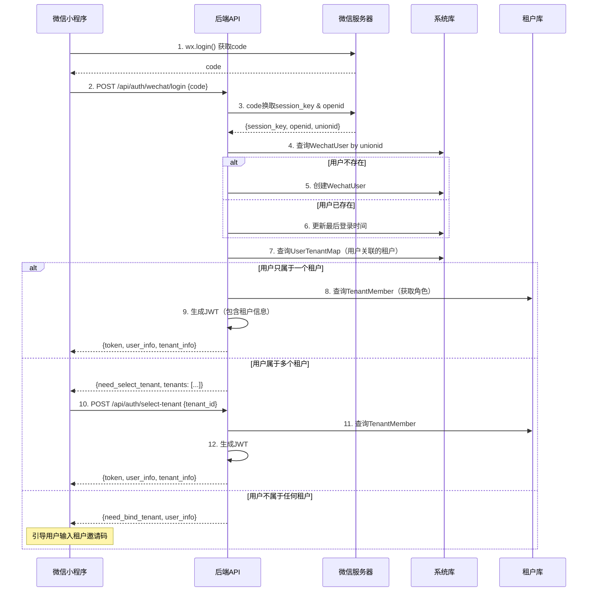

# 微信小程序多租户用户系统设计方案

## 📋 目录
- [一、背景与挑战](#一背景与挑战)
- [二、架构设计方案](#二架构设计方案)
- [三、数据模型设计](#三数据模型设计)
- [四、登录流程设计](#四登录流程设计)
- [五、租户切换方案](#五租户切换方案)
- [六、核心功能实现](#六核心功能实现)
- [七、安全与权限控制](#七安全与权限控制)
- [八、实施步骤](#八实施步骤)

---

## 一、背景与挑战

### 1.1 业务场景
- **行业特性**：中小型服装工厂，员工流动性大
- **使用场景**：员工主要使用微信小程序进行日常操作
- **核心痛点**：员工从工厂A离职后，可能入职工厂B（也使用本系统）

### 1.2 核心挑战

#### 挑战1：用户的全局唯一性
- ✅ 同一个微信用户可能在多个租户（工厂）中工作
- ✅ 用户的基础信息应该全局唯一（如微信UnionID）
- ✅ 但用户在不同租户中的角色、权限、业务数据应该隔离

#### 挑战2：人员流动管理
- ✅ 员工离职后，如何处理其在原租户中的数据？
- ✅ 员工入职新租户时，如何快速关联已有的微信账号？
- ✅ 如何避免重复注册和数据冗余？

#### 挑战3：微信登录特性
- ✅ 微信UnionID：同一微信开放平台下的唯一标识
- ✅ 微信OpenID：同一小程序下的唯一标识
- ✅ 手机号授权：用户可能拒绝授权手机号
- ✅ 用户信息更新：微信头像、昵称可能变化

---

## 二、架构设计方案

### 2.1 整体架构

采用 **"全局用户 + 租户成员"双表模型**，保持现有的数据库物理隔离架构：

```
┌──────────────────────────────────────────────────┐
│  系统库 (tenant_system)                          │
├──────────────────────────────────────────────────┤
│  📦 tenant              租户表                   │
│  📦 wechat_user         全局微信用户表 ← 新增   │
│  📦 user_tenant_map     用户租户映射表 ← 新增   │
│  📦 admin               系统管理员               │
└──────────────────────────────────────────────────┘
           ↓ 一个用户可以属于多个租户
┌──────────────────────────────────────────────────┐
│  租户库 A (tenant_ace)                           │
├──────────────────────────────────────────────────┤
│  📦 member              租户成员表 ← 改造       │
│  📦 role                角色表                   │
│  📦 order               订单表                   │
│  └─ ... 其他业务数据                             │
└──────────────────────────────────────────────────┘

┌──────────────────────────────────────────────────┐
│  租户库 B (tenant_factory_b)                     │
├──────────────────────────────────────────────────┤
│  📦 member              租户成员表               │
│  └─ ... 业务数据                                 │
└──────────────────────────────────────────────────┘
```

### 2.2 设计原则

1. **用户全局唯一**：微信UnionID作为全局用户唯一标识
2. **租户数据隔离**：业务数据仍然存储在各租户独立数据库中
3. **灵活的关联关系**：支持一个用户在多个租户中拥有不同角色
4. **向下兼容**：保持现有系统管理员（Admin）登录方式不变

---

## 三、数据模型设计

### 3.1 系统库模型

#### 3.1.1 WechatUser（全局微信用户表）

存储位置：`tenant_system.wechat_user`

```go
// WechatUser 全局微信用户（存储在系统库）
type WechatUser struct {
    ID          string `json:"id" bson:"_id,omitempty"`          // MongoDB ObjectID
    UnionID     string `json:"union_id" bson:"union_id"`         // 微信UnionID（全局唯一）
    Phone       string `json:"phone" bson:"phone"`               // 手机号（可能为空）
    Nickname    string `json:"nickname" bson:"nickname"`         // 微信昵称
    Avatar      string `json:"avatar" bson:"avatar"`             // 微信头像
    Gender      int    `json:"gender" bson:"gender"`             // 性别：0-未知 1-男 2-女
    Country     string `json:"country" bson:"country"`           // 国家
    Province    string `json:"province" bson:"province"`         // 省份
    City        string `json:"city" bson:"city"`                 // 城市
    Language    string `json:"language" bson:"language"`         // 语言
    
    // 多租户关联（仅用于快速查询）
    TenantIDs   []string `json:"tenant_ids" bson:"tenant_ids"`   // 用户关联的租户ID列表
    
    // 系统字段
    Status      int    `json:"status" bson:"status"`             // 状态：1-正常 0-禁用
    IsDeleted   int    `json:"is_deleted" bson:"is_deleted"`     // 是否删除
    CreatedAt   int64  `json:"created_at" bson:"created_at"`     // 创建时间
    UpdatedAt   int64  `json:"updated_at" bson:"updated_at"`     // 更新时间
    LastLoginAt int64  `json:"last_login_at" bson:"last_login_at"` // 最后登录时间
}

// 索引
// - union_id: 唯一索引
// - phone: 唯一索引（稀疏索引，允许null）
// - tenant_ids: 数组索引（快速查询用户属于哪些租户）
```

#### 3.1.2 UserTenantMap（用户租户映射表）

存储位置：`tenant_system.user_tenant_map`

```go
// UserTenantMap 用户-租户关系映射表（存储在系统库）
type UserTenantMap struct {
    ID          string `json:"id" bson:"_id,omitempty"`        // MongoDB ObjectID
    UserID      string `json:"user_id" bson:"user_id"`         // 微信用户ID（WechatUser._id）
    UnionID     string `json:"union_id" bson:"union_id"`       // 冗余字段，便于查询
    TenantID    string `json:"tenant_id" bson:"tenant_id"`     // 租户ID
    TenantCode  string `json:"tenant_code" bson:"tenant_code"` // 租户代码
    MemberID    string `json:"member_id" bson:"member_id"`     // 在租户库中的成员ID
    
    // 关系状态
    Status      string `json:"status" bson:"status"`           // 状态：active-在职 inactive-离职 pending-待审核
    JoinedAt    int64  `json:"joined_at" bson:"joined_at"`     // 加入时间
    LeftAt      int64  `json:"left_at" bson:"left_at"`         // 离职时间（如果已离职）
    
    // 系统字段
    IsDeleted   int   `json:"is_deleted" bson:"is_deleted"`    // 软删除
    CreatedAt   int64 `json:"created_at" bson:"created_at"`
    UpdatedAt   int64 `json:"updated_at" bson:"updated_at"`
}

// 索引
// - user_id + tenant_id: 联合唯一索引
// - union_id + status: 组合索引（查询用户所有在职租户）
// - tenant_id + status: 组合索引（查询租户所有在职成员）
```

### 3.2 租户库模型

#### 3.2.1 TenantMember（租户成员表）

存储位置：`tenant_xxx.member`（原admin表改造）

```go
// TenantMember 租户成员（存储在各租户库中）
type TenantMember struct {
    ID          string   `json:"id" bson:"_id,omitempty"`      // MongoDB ObjectID
    
    // 关联全局用户
    UnionID     string   `json:"union_id" bson:"union_id"`     // 微信UnionID（关联全局用户）
    UserID      string   `json:"user_id" bson:"user_id"`       // 全局用户ID（WechatUser._id）
    
    // 租户内信息（可被租户管理员修改）
    Name        string   `json:"name" bson:"name"`             // 员工姓名（在本租户的称呼）
    JobNumber   string   `json:"job_number" bson:"job_number"` // 工号
    Department  string   `json:"department" bson:"department"` // 部门
    Position    string   `json:"position" bson:"position"`     // 岗位
    Phone       string   `json:"phone" bson:"phone"`           // 联系电话（冗余）
    
    // 权限与角色
    Roles       []string `json:"role" bson:"role"`             // 角色ID数组
    Permissions []string `json:"permissions" bson:"permissions"` // 额外权限
    
    // 状态
    Status      string   `json:"status" bson:"status"`         // 状态：active-在职 inactive-离职
    EmployedAt  int64    `json:"employed_at" bson:"employed_at"`  // 入职时间
    LeftAt      int64    `json:"left_at" bson:"left_at"`       // 离职时间
    
    // 系统字段
    IsDeleted   int      `json:"is_deleted" bson:"is_deleted"`
    CreatedBy   string   `json:"created_by" bson:"created_by"`
    UpdatedBy   string   `json:"updated_by" bson:"updated_by"`
    CreatedAt   int64    `json:"created_at" bson:"created_at"`
    UpdatedAt   int64    `json:"updated_at" bson:"updated_at"`
}

// 索引
// - union_id: 唯一索引
// - job_number: 唯一索引（如果使用）
// - status + is_deleted: 组合索引（查询在职员工）
```

---

## 四、登录流程设计

### 4.1 微信小程序登录流程



### 4.2 首次登录-绑定租户流程

```
用户首次登录 → 微信授权 → 创建全局用户
    ↓
用户输入租户邀请码 → 验证邀请码
    ↓
在租户库创建Member记录 → 在系统库创建UserTenantMap
    ↓
生成JWT Token → 登录成功
```

### 4.3 员工离职-入职新租户流程

```
员工在租户A离职
    ↓
更新 UserTenantMap.status = 'inactive'
更新 TenantMember.status = 'inactive'
    ↓
员工入职租户B
    ↓
使用相同微信账号登录 → 检测到已有WechatUser
    ↓
输入租户B邀请码 → 在租户B创建新的Member记录
    ↓
创建新的UserTenantMap关联（status='active'）
    ↓
用户现在可以在租户A（已离职）和租户B（在职）间切换查看
```

---

## 五、租户切换方案

### 5.1 切换场景

#### 场景1：在职多个租户（兼职）
- 用户同时在工厂A和工厂B工作
- 可以实时切换租户，查看不同租户的数据

#### 场景2：查看历史租户（已离职）
- 用户在工厂A离职，但想查看历史工单
- 切换到已离职租户，只读模式

### 5.2 切换实现方案

#### 方案A：重新登录（推荐 ⭐）

```javascript
// 小程序端
async switchTenant(tenantId) {
  const res = await api.post('/api/auth/switch-tenant', {
    tenant_id: tenantId
  });
  
  // 更新本地Token
  wx.setStorageSync('token', res.data.token);
  
  // 重新加载页面
  wx.reLaunch({url: '/pages/index/index'});
}
```

**优点**：
- ✅ JWT中包含租户信息，后端自动切换数据库
- ✅ 安全性高，每次切换都重新验证权限
- ✅ 实现简单

**缺点**：
- ❌ 需要重新加载页面

#### 方案B：Header传递（适合频繁切换）

```javascript
// 小程序端：每个请求都带上租户ID
wx.request({
  url: '/api/order/list',
  header: {
    'Authorization': 'Bearer ' + token,
    'X-Tenant-ID': currentTenantId  // ← 当前租户
  }
});
```

**后端中间件**：
```go
// 优先使用Header中的租户ID，但需验证用户有权限访问该租户
func TenantSwitchMiddleware() gin.HandlerFunc {
    return func(c *gin.Context) {
        // 从JWT获取用户ID
        claims := c.MustGet("claims").(*jwt.Claims)
        
        // 从Header获取要切换的租户ID
        requestTenantID := c.GetHeader("X-Tenant-ID")
        if requestTenantID == "" {
            requestTenantID = claims.TenantID // 默认使用JWT中的租户
        }
        
        // ⚠️ 验证用户是否有权访问该租户
        if requestTenantID != claims.TenantID {
            valid := validateUserTenantAccess(claims.UserID, requestTenantID)
            if !valid {
                response.Error(c, "无权访问该租户")
                c.Abort()
                return
            }
        }
        
        // 设置租户上下文
        ctx := tenantCtx.WithTenantID(c.Request.Context(), requestTenantID)
        c.Request = c.Request.WithContext(ctx)
        
        c.Next()
    }
}
```

---

## 六、核心功能实现

### 6.1 微信登录接口

```go
// app/auth/dto/wechat.go
package dto

type WechatLoginRequest struct {
    Code        string `json:"code" binding:"required"`         // 微信登录code
    EncryptData string `json:"encrypted_data"`                  // 加密的用户信息
    IV          string `json:"iv"`                              // 加密算法初始向量
}

type WechatLoginResponse struct {
    NeedSelectTenant bool                `json:"need_select_tenant"` // 是否需要选择租户
    NeedBindTenant   bool                `json:"need_bind_tenant"`   // 是否需要绑定租户
    Token            string              `json:"token,omitempty"`
    UserInfo         *WechatUserInfo     `json:"user_info"`
    Tenants          []UserTenantInfo    `json:"tenants,omitempty"` // 用户关联的租户列表
    CurrentTenant    *UserTenantInfo     `json:"current_tenant,omitempty"`
}

type WechatUserInfo struct {
    ID       string `json:"id"`
    UnionID  string `json:"union_id"`
    Nickname string `json:"nickname"`
    Avatar   string `json:"avatar"`
    Phone    string `json:"phone"`
}

type UserTenantInfo struct {
    TenantID   string `json:"tenant_id"`
    TenantCode string `json:"tenant_code"`
    TenantName string `json:"tenant_name"`
    Status     string `json:"status"`      // active/inactive
    Role       string `json:"role"`        // 在该租户的角色
    JoinedAt   int64  `json:"joined_at"`
}
```

```go
// app/auth/services/wechat.go
package services

import (
    "context"
    "fmt"
    "mule-cloud/app/auth/dto"
    "mule-cloud/core/jwt"
    "mule-cloud/internal/models"
    "mule-cloud/internal/repository"
    tenantCtx "mule-cloud/core/context"
    "time"
)

type WechatService struct {
    wechatUserRepo  repository.WechatUserRepository
    userTenantRepo  repository.UserTenantMapRepository
    tenantRepo      repository.TenantRepository
    memberRepo      repository.TenantMemberRepository
    jwtManager      *jwt.JWTManager
    
    appID           string
    appSecret       string
}

// WechatLogin 微信登录
func (s *WechatService) WechatLogin(req dto.WechatLoginRequest) (*dto.WechatLoginResponse, error) {
    ctx := context.Background()
    
    // 1. 调用微信接口，用code换取session_key和openid
    wxSession, err := s.getWechatSession(req.Code)
    if err != nil {
        return nil, fmt.Errorf("微信登录失败: %w", err)
    }
    
    // 2. 解密用户信息（如果提供了加密数据）
    var userInfo *WechatUserInfo
    if req.EncryptData != "" {
        userInfo, err = s.decryptWechatUserInfo(wxSession.SessionKey, req.EncryptData, req.IV)
        if err != nil {
            return nil, fmt.Errorf("解密用户信息失败: %w", err)
        }
    }
    
    // 3. 查询或创建全局用户（系统库）
    systemCtx := tenantCtx.WithTenantCode(ctx, "")
    wechatUser, err := s.wechatUserRepo.GetByUnionID(systemCtx, wxSession.UnionID)
    
    if wechatUser == nil {
        // 首次登录，创建全局用户
        wechatUser = &models.WechatUser{
            UnionID:   wxSession.UnionID,
            Nickname:  userInfo.Nickname,
            Avatar:    userInfo.Avatar,
            Status:    1,
            CreatedAt: time.Now().Unix(),
            UpdatedAt: time.Now().Unix(),
        }
        err = s.wechatUserRepo.Create(systemCtx, wechatUser)
        if err != nil {
            return nil, fmt.Errorf("创建用户失败: %w", err)
        }
    } else {
        // 更新最后登录时间和用户信息
        s.wechatUserRepo.Update(systemCtx, wechatUser.ID, map[string]interface{}{
            "last_login_at": time.Now().Unix(),
            "nickname":      userInfo.Nickname,
            "avatar":        userInfo.Avatar,
        })
    }
    
    // 4. 查询用户关联的租户（系统库）
    tenantMaps, err := s.userTenantRepo.GetUserActiveTenants(systemCtx, wechatUser.ID)
    if err != nil {
        return nil, fmt.Errorf("查询用户租户失败: %w", err)
    }
    
    // 5. 根据租户数量返回不同响应
    if len(tenantMaps) == 0 {
        // 用户没有关联任何租户，需要绑定
        return &dto.WechatLoginResponse{
            NeedBindTenant: true,
            UserInfo: &dto.WechatUserInfo{
                ID:       wechatUser.ID,
                UnionID:  wechatUser.UnionID,
                Nickname: wechatUser.Nickname,
                Avatar:   wechatUser.Avatar,
                Phone:    wechatUser.Phone,
            },
        }, nil
    }
    
    if len(tenantMaps) == 1 {
        // 只有一个租户，直接登录
        tenantMap := tenantMaps[0]
        token, currentTenant, err := s.generateTokenForTenant(wechatUser, &tenantMap)
        if err != nil {
            return nil, err
        }
        
        return &dto.WechatLoginResponse{
            Token:         token,
            UserInfo:      s.buildUserInfo(wechatUser),
            CurrentTenant: currentTenant,
        }, nil
    }
    
    // 多个租户，需要用户选择
    tenantInfos := make([]dto.UserTenantInfo, 0, len(tenantMaps))
    for _, tm := range tenantMaps {
        tenant, _ := s.tenantRepo.Get(systemCtx, tm.TenantID)
        tenantInfos = append(tenantInfos, dto.UserTenantInfo{
            TenantID:   tm.TenantID,
            TenantCode: tm.TenantCode,
            TenantName: tenant.Name,
            Status:     tm.Status,
            JoinedAt:   tm.JoinedAt,
        })
    }
    
    return &dto.WechatLoginResponse{
        NeedSelectTenant: true,
        UserInfo:         s.buildUserInfo(wechatUser),
        Tenants:          tenantInfos,
    }, nil
}

// generateTokenForTenant 为指定租户生成Token
func (s *WechatService) generateTokenForTenant(user *models.WechatUser, tenantMap *models.UserTenantMap) (string, *dto.UserTenantInfo, error) {
    // 查询租户信息
    systemCtx := tenantCtx.WithTenantCode(context.Background(), "")
    tenant, err := s.tenantRepo.Get(systemCtx, tenantMap.TenantID)
    if err != nil {
        return "", nil, fmt.Errorf("查询租户失败: %w", err)
    }
    
    // 查询租户成员信息（获取角色）
    tenantCtx := tenantCtx.WithTenantCode(context.Background(), tenantMap.TenantCode)
    member, err := s.memberRepo.GetByUnionID(tenantCtx, user.UnionID)
    if err != nil {
        return "", nil, fmt.Errorf("查询成员信息失败: %w", err)
    }
    
    // 生成JWT Token
    token, err := s.jwtManager.GenerateToken(
        user.ID,
        user.Nickname,
        tenantMap.TenantID,
        tenantMap.TenantCode,
        member.Roles,
    )
    if err != nil {
        return "", nil, fmt.Errorf("生成token失败: %w", err)
    }
    
    currentTenant := &dto.UserTenantInfo{
        TenantID:   tenant.ID,
        TenantCode: tenant.Code,
        TenantName: tenant.Name,
        Status:     tenantMap.Status,
        Role:       member.Roles[0], // 简化处理
        JoinedAt:   tenantMap.JoinedAt,
    }
    
    return token, currentTenant, nil
}

// getWechatSession 调用微信接口获取session
func (s *WechatService) getWechatSession(code string) (*WechatSession, error) {
    // 调用微信API: https://api.weixin.qq.com/sns/jscode2session
    // 参数: appid, secret, js_code, grant_type
    // TODO: 实现微信API调用
    return &WechatSession{}, nil
}

type WechatSession struct {
    OpenID     string `json:"openid"`
    SessionKey string `json:"session_key"`
    UnionID    string `json:"unionid"`
}
```

### 6.2 绑定租户接口

```go
// BindTenant 绑定租户（通过邀请码）
func (s *WechatService) BindTenant(userID string, inviteCode string) error {
    ctx := context.Background()
    systemCtx := tenantCtx.WithTenantCode(ctx, "")
    
    // 1. 验证邀请码，获取租户信息
    tenant, err := s.tenantRepo.GetByInviteCode(systemCtx, inviteCode)
    if err != nil || tenant == nil {
        return fmt.Errorf("无效的邀请码")
    }
    
    // 2. 检查用户是否已经在该租户中
    existing, _ := s.userTenantRepo.GetByUserAndTenant(systemCtx, userID, tenant.ID)
    if existing != nil && existing.Status == "active" {
        return fmt.Errorf("您已经是该租户成员")
    }
    
    // 3. 获取用户信息
    wechatUser, err := s.wechatUserRepo.Get(systemCtx, userID)
    if err != nil {
        return fmt.Errorf("用户不存在")
    }
    
    // 4. 在租户库创建成员记录
    tenantCtx := tenantCtx.WithTenantCode(ctx, tenant.Code)
    member := &models.TenantMember{
        UnionID:    wechatUser.UnionID,
        UserID:     wechatUser.ID,
        Name:       wechatUser.Nickname,
        Phone:      wechatUser.Phone,
        Roles:      []string{"employee"}, // 默认角色
        Status:     "active",
        EmployedAt: time.Now().Unix(),
        CreatedAt:  time.Now().Unix(),
    }
    err = s.memberRepo.Create(tenantCtx, member)
    if err != nil {
        return fmt.Errorf("创建成员失败: %w", err)
    }
    
    // 5. 在系统库创建用户-租户映射
    userTenantMap := &models.UserTenantMap{
        UserID:     userID,
        UnionID:    wechatUser.UnionID,
        TenantID:   tenant.ID,
        TenantCode: tenant.Code,
        MemberID:   member.ID,
        Status:     "active",
        JoinedAt:   time.Now().Unix(),
        CreatedAt:  time.Now().Unix(),
    }
    err = s.userTenantRepo.Create(systemCtx, userTenantMap)
    if err != nil {
        // 回滚：删除成员记录
        s.memberRepo.HardDelete(tenantCtx, member.ID)
        return fmt.Errorf("创建关联失败: %w", err)
    }
    
    // 6. 更新用户的租户列表（冗余字段）
    s.wechatUserRepo.AddTenant(systemCtx, userID, tenant.ID)
    
    return nil
}
```

### 6.3 切换租户接口

```go
// SwitchTenant 切换租户（重新生成Token）
func (s *WechatService) SwitchTenant(userID string, tenantID string) (*dto.WechatLoginResponse, error) {
    ctx := context.Background()
    systemCtx := tenantCtx.WithTenantCode(ctx, "")
    
    // 1. 验证用户是否有权访问该租户
    tenantMap, err := s.userTenantRepo.GetByUserAndTenant(systemCtx, userID, tenantID)
    if err != nil || tenantMap == nil {
        return nil, fmt.Errorf("无权访问该租户")
    }
    
    // 2. 获取用户信息
    wechatUser, err := s.wechatUserRepo.Get(systemCtx, userID)
    if err != nil {
        return nil, fmt.Errorf("用户不存在")
    }
    
    // 3. 生成新的Token
    token, currentTenant, err := s.generateTokenForTenant(wechatUser, tenantMap)
    if err != nil {
        return nil, err
    }
    
    return &dto.WechatLoginResponse{
        Token:         token,
        UserInfo:      s.buildUserInfo(wechatUser),
        CurrentTenant: currentTenant,
    }, nil
}
```

---

## 七、安全与权限控制

### 7.1 安全考虑

#### 1. 租户隔离验证
```go
// 中间件：验证用户是否有权访问当前租户
func ValidateTenantAccess() gin.HandlerFunc {
    return func(c *gin.Context) {
        claims := c.MustGet("claims").(*jwt.Claims)
        
        // JWT中的租户ID
        jwtTenantID := claims.TenantID
        
        // 如果Header中指定了不同的租户ID，需要验证
        headerTenantID := c.GetHeader("X-Tenant-ID")
        if headerTenantID != "" && headerTenantID != jwtTenantID {
            // 验证用户是否有权访问该租户
            valid := validateUserTenantAccess(claims.UserID, headerTenantID)
            if !valid {
                response.Error(c, "无权访问该租户")
                c.Abort()
                return
            }
        }
        
        c.Next()
    }
}
```

#### 2. 离职员工权限降级
```go
// 查询成员信息时检查状态
member, err := memberRepo.GetByUnionID(ctx, unionID)
if member.Status == "inactive" {
    // 已离职，只允许只读操作
    if c.Request.Method != "GET" {
        response.Error(c, "您已离职，无法执行此操作")
        c.Abort()
        return
    }
}
```

### 7.2 数据权限控制

#### 离职员工数据访问策略

| 场景 | 策略 | 说明 |
|------|------|------|
| 查看历史订单 | ✅ 允许（只读） | 可以查看自己参与的历史订单 |
| 修改订单 | ❌ 禁止 | 已离职，无修改权限 |
| 查看其他员工信息 | ❌ 禁止 | 离职后不能查看在职员工 |
| 下载历史报表 | ✅ 允许（限制） | 只能下载自己相关的数据 |

---

## 八、实施步骤

### 第一阶段：数据模型与基础服务（2-3天）

#### Step 1: 创建新数据模型

```bash
# 创建模型文件
touch internal/models/wechat_user.go
touch internal/models/user_tenant_map.go
```

#### Step 2: 创建Repository层

```bash
touch internal/repository/wechat_user.go
touch internal/repository/user_tenant_map.go
```

#### Step 3: 改造现有Admin模型为TenantMember

```go
// 重命名或新建
cp internal/models/admin.go internal/models/tenant_member.go
# 修改结构体，添加UnionID、UserID等字段
```

### 第二阶段：微信登录服务（2-3天）

#### Step 4: 实现微信登录服务

```bash
mkdir app/auth/services/wechat
touch app/auth/services/wechat/login.go
touch app/auth/services/wechat/session.go
```

#### Step 5: 添加微信登录接口

```bash
# 添加DTO
touch app/auth/dto/wechat.go

# 添加Endpoint
touch app/auth/endpoint/wechat.go

# 添加Transport
# 修改 app/auth/transport/auth.go
```

#### Step 6: 注册路由

```go
// cmd/auth/main.go
wechatSvc := services.NewWechatService(jwtManager, cfg.Wechat.AppID, cfg.Wechat.AppSecret)

auth.POST("/wechat/login", transport.WechatLoginHandler(wechatSvc))
auth.POST("/wechat/bind-tenant", transport.BindTenantHandler(wechatSvc))
auth.POST("/wechat/switch-tenant", transport.SwitchTenantHandler(wechatSvc))
```

### 第三阶段：数据迁移（1-2天）

#### Step 7: 编写数据迁移脚本

```javascript
// scripts/migrate_to_wechat_user.js

// 1. 为现有admin用户生成临时UnionID（如果没有微信登录）
// 2. 创建UserTenantMap关联
// 3. 更新Member表结构
```

#### Step 8: 配置微信小程序

```yaml
# config/auth.yaml
wechat:
  app_id: "wxXXXXXXXXXXXXXX"
  app_secret: "XXXXXXXXXXXXXXXXXXXXXXXX"
  # 如果有微信开放平台，配置UnionID
  open_app_id: "wxXXXXXXXXXXXXXX"
```

### 第四阶段：小程序端适配（2-3天）

#### Step 9: 小程序登录页面

```javascript
// pages/login/index.js
async wechatLogin() {
  // 1. 获取微信登录code
  const { code } = await wx.login();
  
  // 2. 调用后端登录接口
  const res = await api.post('/api/auth/wechat/login', { code });
  
  // 3. 根据响应处理不同情况
  if (res.data.need_bind_tenant) {
    // 需要绑定租户，跳转到输入邀请码页面
    wx.navigateTo({ url: '/pages/bind-tenant/index' });
  } else if (res.data.need_select_tenant) {
    // 需要选择租户
    wx.navigateTo({ 
      url: '/pages/select-tenant/index',
      data: { tenants: res.data.tenants }
    });
  } else {
    // 直接登录成功
    wx.setStorageSync('token', res.data.token);
    wx.switchTab({ url: '/pages/index/index' });
  }
}
```

### 第五阶段：测试与上线（2-3天）

#### Step 10: 功能测试

- ✅ 新用户首次登录
- ✅ 绑定租户
- ✅ 多租户切换
- ✅ 离职员工登录（只读）
- ✅ 权限验证

#### Step 11: 数据验证

- ✅ 系统库数据完整性
- ✅ 租户库数据隔离
- ✅ 关联关系正确性

---

## 九、最佳实践建议

### 9.1 邀请码设计

```go
// 生成租户邀请码（6位数字，24小时有效）
type TenantInvite struct {
    Code      string `bson:"_id"`           // 6位邀请码
    TenantID  string `bson:"tenant_id"`
    CreatedBy string `bson:"created_by"`
    ExpiresAt int64  `bson:"expires_at"`    // 过期时间
    UsedCount int    `bson:"used_count"`    // 使用次数
    MaxUse    int    `bson:"max_use"`       // 最大使用次数
}

// 生成邀请码
func GenerateInviteCode(tenantID string, maxUse int) string {
    code := fmt.Sprintf("%06d", rand.Intn(1000000))
    // 存储到数据库...
    return code
}
```

### 9.2 手机号绑定策略

**推荐策略**：手机号可选，但建议绑定

```go
// 获取手机号（微信接口）
async function getPhoneNumber(e) {
  if (e.detail.errMsg === 'getPhoneNumber:ok') {
    // 发送到后端绑定
    await api.post('/api/user/bind-phone', {
      encrypted_data: e.detail.encryptedData,
      iv: e.detail.iv
    });
  }
}
```

### 9.3 离职员工管理

#### 主动离职流程
```go
// 租户管理员将员工设置为离职
func (s *MemberService) SetMemberInactive(memberID string) error {
    // 1. 更新租户库中的成员状态
    member.Status = "inactive"
    member.LeftAt = time.Now().Unix()
    
    // 2. 更新系统库中的关联状态
    userTenantMap.Status = "inactive"
    userTenantMap.LeftAt = time.Now().Unix()
    
    return nil
}
```

#### 自动离职检测（可选）
- 超过30天未登录，自动标记为待确认
- 60天未登录，自动转为离职状态

---

## 十、总结

### 核心优势

| 优势 | 说明 |
|------|------|
| ✅ 用户全局唯一 | 一个微信账号，多个租户通用 |
| ✅ 数据完全隔离 | 保持现有的租户数据库物理隔离 |
| ✅ 灵活的关联关系 | 支持一人多租户、离职后数据保留 |
| ✅ 无缝切换 | 员工换工厂后无需重新注册 |
| ✅ 安全可控 | 严格的权限验证和数据隔离 |

### 实施时间表

| 阶段 | 工作量 | 完成标志 |
|------|--------|----------|
| 数据模型 | 2-3天 | 创建WechatUser、UserTenantMap等表 |
| 微信登录服务 | 2-3天 | 实现登录、绑定、切换接口 |
| 数据迁移 | 1-2天 | 现有用户数据迁移完成 |
| 小程序适配 | 2-3天 | 登录、选择租户等页面 |
| 测试上线 | 2-3天 | 功能测试、数据验证 |
| **总计** | **10-15天** | 完整功能上线 |

### 后续优化方向

1. **手机号快速登录**：已绑定手机号的用户可以手机号验证码登录
2. **二维码邀请**：扫描租户二维码直接加入
3. **审批流程**：新员工加入需要管理员审批
4. **离职交接**：离职员工的业务数据交接给继任者
5. **数据导出**：允许离职员工导出自己的历史数据

---

**文档版本**：v1.0  
**创建日期**：2025-10-08  
**作者**：Mule-Cloud AI Assistant  
**状态**：待审核


