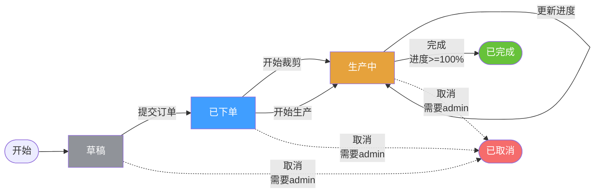

# 订单工作流高级功能说明

## 📋 概述

本次升级为订单工作流系统增加了三大高级功能：
1. **工作流可视化** - 提供流程图和可视化管理界面
2. **条件转换规则** - 支持复杂的状态转换条件和权限控制
3. **状态回滚功能** - 支持撤销错误的状态转换

## 🎯 新增功能详解

### 1. 工作流可视化

#### 后端API
- **获取工作流定义**: `GET /admin/order/workflow/definition`
- **获取Mermaid流程图**: `GET /admin/order/workflow/mermaid`
- **获取转换规则**: `GET /admin/order/workflow/rules`

#### 前端页面
- 位置: `frontend/src/views/order/workflow/index.vue`
- 功能:
  - 📊 Mermaid流程图展示
  - 📝 状态和事件说明
  - 📋 转换规则表格
  - 🔍 订单状态查询

#### Mermaid 流程图示例


### 2. 条件转换规则

#### 核心功能
- ✅ **条件检查**: 转换前验证业务条件
- ✅ **权限控制**: 基于角色的转换权限
- ✅ **自定义规则**: 支持扩展转换条件

#### 条件示例

##### 完成订单条件
```go
// 必须进度达到100%才能完成
{
    From:  StatusProduction,
    Event: EventComplete,
    To:    StatusCompleted,
    Condition: func(ctx context.Context, orderID string, metadata map[string]interface{}) (bool, string) {
        if progress, ok := metadata["progress"].(float64); ok {
            if progress >= 1.0 {
                return true, ""
            }
            return false, fmt.Sprintf("进度不足：当前%.1f%%，需要100%%", progress*100)
        }
        // 从数据库查询进度
        // ...
    },
}
```

##### 取消订单权限
```go
// 取消订单需要admin角色
{
    From:        StatusProduction,
    Event:       EventCancel,
    To:          StatusCancelled,
    RequireRole: "admin",
}
```

#### 使用API

**执行状态转换**
```http
POST /admin/order/workflow/transition
Content-Type: application/json

{
  "order_id": "68e48c19b4eb03ee2a2b8dcd",
  "event": "complete",
  "reason": "订单已完成所有工序",
  "metadata": {
    "progress": 1.0
  }
}
```

**响应**
```json
{
  "code": 0,
  "msg": "success",
  "data": {
    "message": "状态转换成功"
  }
}
```

**失败示例（条件不满足）**
```json
{
  "code": 500,
  "msg": "状态转换失败: 进度不足：当前85.0%，需要100%"
}
```

### 3. 状态回滚功能

#### 核心功能
- ✅ **撤销转换**: 回滚到上一个状态
- ✅ **回滚记录**: 完整的回滚历史追踪
- ✅ **原因记录**: 必须提供回滚原因
- ✅ **安全限制**: 已完成和已取消的订单不允许回滚

#### 使用API

**回滚订单状态**
```http
POST /admin/order/workflow/rollback
Content-Type: application/json

{
  "order_id": "68e48c19b4eb03ee2a2b8dcd",
  "reason": "误操作，需要回滚到生产中状态"
}
```

**响应**
```json
{
  "code": 0,
  "msg": "success",
  "data": {
    "message": "状态回滚成功"
  }
}
```

**查看回滚历史**
```http
GET /admin/order/workflow/orders/68e48c19b4eb03ee2a2b8dcd/rollbacks?limit=10
```

**响应**
```json
{
  "code": 0,
  "msg": "success",
  "data": {
    "order_id": "68e48c19b4eb03ee2a2b8dcd",
    "rollbacks": [
      {
        "order_id": "68e48c19b4eb03ee2a2b8dcd",
        "rollback_from": 3,
        "rollback_to": 2,
        "original_event": "complete",
        "reason": "误操作，需要回滚到生产中状态",
        "operator": "admin",
        "timestamp": 1729261234,
        "metadata": {
          "original_transition": {...}
        }
      }
    ]
  }
}
```

## 📡 完整API列表

| 方法 | 路径 | 说明 |
|------|------|------|
| GET | `/admin/order/workflow/definition` | 获取工作流定义 |
| GET | `/admin/order/workflow/mermaid` | 获取Mermaid流程图 |
| GET | `/admin/order/workflow/rules` | 获取所有转换规则 |
| GET | `/admin/order/workflow/orders/:order_id/status` | 获取订单当前状态 |
| GET | `/admin/order/workflow/orders/:order_id/history` | 获取状态历史 |
| GET | `/admin/order/workflow/orders/:order_id/rollbacks` | 获取回滚历史 |
| POST | `/admin/order/workflow/transition` | 执行状态转换 |
| POST | `/admin/order/workflow/rollback` | 回滚订单状态 |

## 🎨 前端配置

### 添加工作流管理菜单

由于系统使用后台动态路由，需要在数据库中添加菜单配置：

```javascript
// 在系统管理 -> 菜单管理中添加
{
  "title": "工作流管理",
  "name": "order-workflow",
  "path": "/order/workflow",
  "component": "views/order/workflow/index.vue",
  "icon": "carbon:flow",
  "parent_id": "订单管理的菜单ID", // 作为订单管理的子菜单
  "sort": 50,
  "hidden": false,
  "cache": true
}
```

### 或者在订单列表页添加快捷入口

在 `frontend/src/views/order/orders/index.vue` 中添加工作流按钮：

```vue
<template>
  <!-- 在页面顶部添加 -->
  <NButton type="info" @click="$router.push('/order/workflow')">
    <template #icon>
      <Icon icon="carbon:flow" />
    </template>
    工作流管理
  </NButton>
</template>
```

## 🔧 核心代码结构

### 后端

```
core/workflow/
  ├── order_workflow.go           # 基础工作流引擎
  └── order_workflow_advanced.go  # 高级功能（条件、回滚）

app/workflow/
  ├── services/
  │   └── workflow.go             # 工作流服务
  ├── dto/
  │   └── workflow.go             # 数据传输对象
  └── transport/
      └── workflow.go             # HTTP处理器

cmd/order/main.go                 # 工作流路由注册
```

### 前端

```
frontend/src/
  ├── views/order/workflow/
  │   └── index.vue               # 工作流可视化页面
  ├── service/api/
  │   └── workflow.ts             # 工作流API服务
  └── typings/api/
      └── workflow.d.ts           # TypeScript类型定义
```

## 📊 状态转换规则表

| 起始状态 | 事件 | 目标状态 | 条件 | 权限 |
|---------|------|---------|------|------|
| 草稿 | 提交订单 | 已下单 | - | - |
| 已下单 | 开始裁剪 | 生产中 | - | - |
| 已下单 | 开始生产 | 生产中 | - | - |
| 生产中 | 更新进度 | 生产中 | - | - |
| 生产中 | 完成 | 已完成 | 进度≥100% | - |
| 草稿 | 取消 | 已取消 | - | admin |
| 已下单 | 取消 | 已取消 | - | admin |
| 生产中 | 取消 | 已取消 | - | admin |

## 🚀 使用场景

### 场景1：订单完成校验
当订单进度未达到100%时尝试完成订单，系统自动拒绝并提示进度不足。

### 场景2：权限控制
普通用户无法取消生产中的订单，只有admin角色才有权限。

### 场景3：误操作回滚
生产主管误将订单标记为已完成，可以立即回滚到生产中状态，继续生产。

### 场景4：工作流审计
查看订单的完整状态历史和所有回滚记录，便于追溯和审计。

## 🔄 自动状态转换

系统仍保留原有的自动状态转换逻辑：

1. **创建裁剪任务** → 订单自动变更为"生产中"
2. **创建裁剪批次** → 订单自动变更为"生产中"
3. **上报工序进度** → 自动计算订单整体进度
   - 进度 > 0% → 状态变更为"生产中"
   - 进度 = 100% → 状态变更为"已完成"

## 📝 扩展指南

### 添加新的转换条件

编辑 `core/workflow/order_workflow_advanced.go`：

```go
var advancedTransitions = []TransitionRule{
    // ... 现有规则
    
    // 添加新规则
    {
        From:  StatusProduction,
        Event: "quality_check",
        To:    StatusQualityCheck,
        Condition: func(ctx context.Context, orderID string, metadata map[string]interface{}) (bool, string) {
            // 自定义条件逻辑
            qualityScore := metadata["quality_score"].(float64)
            if qualityScore >= 90 {
                return true, ""
            }
            return false, fmt.Sprintf("质量分数不足: %.1f", qualityScore)
        },
    },
}
```

### 添加新的状态

1. 在 `core/workflow/order_workflow.go` 中添加状态常量
2. 在 `GetWorkflowDefinition()` 中添加状态定义
3. 在 `advancedTransitions` 中添加相关转换规则
4. 更新 Mermaid 流程图生成逻辑

## ⚠️ 注意事项

1. **回滚限制**: 已完成和已取消的订单不允许回滚
2. **权限检查**: 敏感操作（如取消订单）需要特定角色权限
3. **并发控制**: 使用Redis确保状态转换的原子性
4. **历史记录**: 所有状态变更都会记录到Redis，保留90天
5. **回滚记录**: 回滚操作会记录到专门的回滚历史中

## 📈 性能优化

1. **Redis缓存**: 当前状态缓存在Redis，避免频繁查询数据库
2. **历史记录**: 使用Redis List存储，自动限制数量（最多50条）
3. **过期策略**: 历史记录自动过期（90天），减少存储压力

## 🎉 总结

高级工作流系统为订单管理提供了：
- ✅ **可视化管理** - 直观的流程图和规则展示
- ✅ **灵活控制** - 条件检查和权限管理
- ✅ **容错机制** - 状态回滚功能
- ✅ **完整审计** - 状态历史和回滚记录

所有功能都已实现并集成到 `order` 服务中，通过 `/admin/order/workflow/*` 路径访问。

