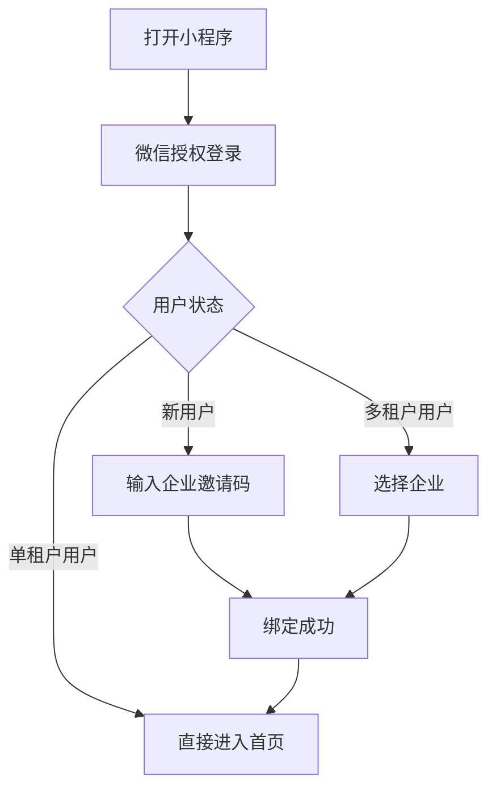
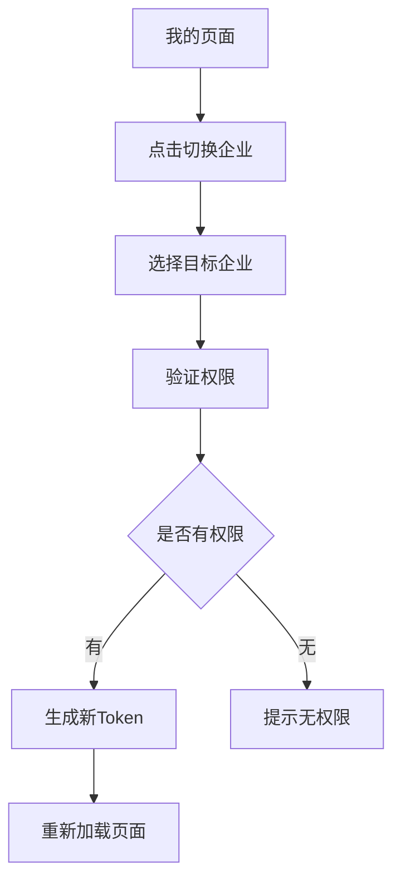

# 智能工厂管理系统 - 小程序端

## 📋 项目介绍

基于 uniapp 开发的智能工厂管理小程序，支持微信小程序平台。实现了微信登录、多租户管理、租户切换等核心功能。

## 🚀 技术栈

- **框架**: uni-app (Vue 3)
- **状态管理**: Pinia
- **UI组件库**: @climblee/uv-ui
- **路由**: uni-mini-router
- **HTTP请求**: axios + uni.request 封装
- **持久化**: pinia-plugin-persistedstate

## 📦 项目结构

```
wxApp/
├── src/
│   ├── api/              # API接口
│   │   └── auth.js       # 认证相关接口
│   ├── pages/            # 页面
│   │   ├── login/        # 登录页
│   │   ├── index/        # 首页
│   │   ├── mine/         # 我的
│   │   ├── bind-tenant/  # 绑定企业
│   │   └── select-tenant/# 选择企业
│   ├── store/            # 状态管理
│   │   ├── index.js      # Pinia配置
│   │   └── modules/
│   │       └── user.js   # 用户状态
│   ├── utils/            # 工具函数
│   │   └── request.js    # 请求封装
│   ├── static/           # 静态资源
│   ├── App.vue           # 应用入口
│   ├── main.js           # 主文件
│   ├── pages.json        # 页面配置
│   └── manifest.json     # 应用配置
├── package.json
├── vite.config.js
└── README.md
```

## 🛠️ 开发指南

### 1. 安装依赖

```bash
yarn install
# 或
npm install
```

### 2. 配置后端地址

修改 `src/utils/request.js` 中的 `BASE_URL`：

```javascript
const BASE_URL = 'http://your-api-domain.com/admin'; // 修改为你的网关地址
```

### 3. 配置微信小程序

在 `manifest.json` 中配置小程序 AppID：

```json
{
  "mp-weixin": {
    "appid": "你的小程序AppID"
  }
}
```

### 4. 运行开发

```bash
# 微信小程序
yarn dev:mp-weixin

# H5
yarn dev:h5
```

### 5. 构建生产

```bash
# 微信小程序
yarn build:mp-weixin

# H5
yarn build:h5
```

## 📱 功能列表

### ✅ 已实现功能

- [x] 微信登录
- [x] 首次登录绑定企业
- [x] 多租户选择
- [x] 租户切换
- [x] 用户信息管理
- [x] 我的企业列表
- [x] 首页数据展示

### 🚧 待开发功能

- [ ] 订单管理
- [ ] 生产进度跟踪
- [ ] 质量检查
- [ ] 数据报表
- [ ] 消息通知
- [ ] 个人资料编辑

## 🔑 核心流程

### 登录流程



### 切换企业流程



## 🎨 UI组件使用

项目使用了 `@climblee/uv-ui` 组件库，已配置 easycom 自动导入。

### 使用示例

```vue
<template>
  <!-- Popup 弹窗 -->
  <uv-popup v-model="show" mode="bottom">
    <view class="content">弹窗内容</view>
  </uv-popup>
  
  <!-- Button 按钮 -->
  <uv-button type="primary" @click="handleClick">按钮</uv-button>
  
  <!-- Icon 图标 -->
  <uv-icon name="home" size="40"></uv-icon>
</template>

<script setup>
import { ref } from 'vue'
const show = ref(false)
</script>
```

更多组件请查看：[uv-ui 文档](https://www.uvui.cn/)

## 🔧 配置说明

### Pinia 持久化

用户状态已配置持久化，自动保存到本地存储：

```javascript
// store/modules/user.js
export const useUserStore = defineStore('user', {
  state: () => ({
    token: '',
    userInfo: null,
    currentTenant: null
  }),
  persist: true // 开启持久化
})
```

### 路由守卫

在页面的 `onMounted` 中检查登录状态：

```javascript
onMounted(() => {
  if (!userStore.isLoggedIn) {
    uni.reLaunch({
      url: '/pages/login/login'
    })
  }
})
```

## 📝 API 接口说明

### 认证接口

| 接口 | 方法 | 说明 |
|------|------|------|
| `/miniapp/wechat/login` | POST | 微信登录 |
| `/miniapp/wechat/bind-tenant` | POST | 绑定企业 |
| `/miniapp/wechat/select-tenant` | POST | 选择企业 |
| `/miniapp/wechat/switch-tenant` | POST | 切换企业（需认证） |
| `/miniapp/user/info` | GET | 获取用户信息（需认证） |
| `/miniapp/user/info` | PUT | 更新用户信息（需认证） |

### 请求示例

```javascript
import { post } from '@/utils/request'

// 微信登录
const res = await post('/miniapp/wechat/login', {
  code: 'wx_login_code'
})

// 切换企业（自动携带Token）
const res = await post('/miniapp/wechat/switch-tenant', {
  tenant_id: 'tenant_id'
})
```

## 🐛 常见问题

### 1. 请求失败，提示网络错误

**原因**：BASE_URL 配置错误或后端服务未启动

**解决**：
1. 检查 `src/utils/request.js` 中的 `BASE_URL` 配置
2. 确保后端服务已启动
3. 检查小程序开发工具中的"不校验合法域名"选项是否勾选

### 2. 微信登录失败

**原因**：AppID 配置错误或未配置

**解决**：
1. 在 `manifest.json` 中配置正确的小程序 AppID
2. 在后端配置文件中配置相同的 AppID 和 AppSecret

### 3. 页面白屏

**原因**：组件导入错误或路由配置错误

**解决**：
1. 检查 `pages.json` 中的页面路径是否正确
2. 检查组件是否正确导入
3. 查看控制台错误信息

### 4. uv-ui 组件不显示

**原因**：组件库未正确安装或配置

**解决**：
```bash
# 重新安装
yarn add @climblee/uv-ui

# 检查 pages.json 中的 easycom 配置
{
  "easycom": {
    "autoscan": true,
    "custom": {
      "^uv-(.*)": "@climblee/uv-ui/components/uv-$1/uv-$1.vue"
    }
  }
}
```

## 📱 运行截图

（待添加）

## 🤝 贡献指南

1. Fork 本仓库
2. 创建特性分支 (`git checkout -b feature/AmazingFeature`)
3. 提交更改 (`git commit -m 'Add some AmazingFeature'`)
4. 推送到分支 (`git push origin feature/AmazingFeature`)
5. 开启 Pull Request

## 📄 开源协议

MIT License

## 👥 联系方式

- 作者：Mule-Cloud Team
- 邮箱：your-email@example.com
- 项目地址：https://github.com/your-org/mule-cloud

## 📅 更新日志

### v1.0.0 (2025-10-11)

- ✨ 实现微信登录功能
- ✨ 实现多租户管理
- ✨ 实现租户切换
- ✨ 完成首页UI
- ✨ 完成我的页面
- ✨ 集成 uv-ui 组件库
- ✨ 配置 Pinia 状态管理
- ✨ 封装网络请求

